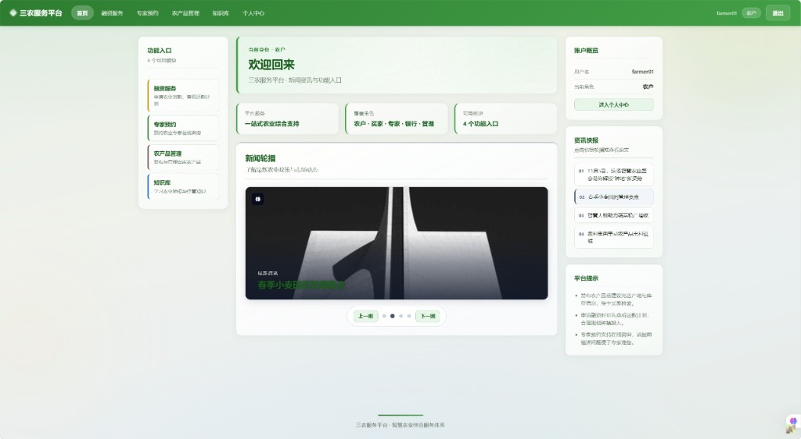
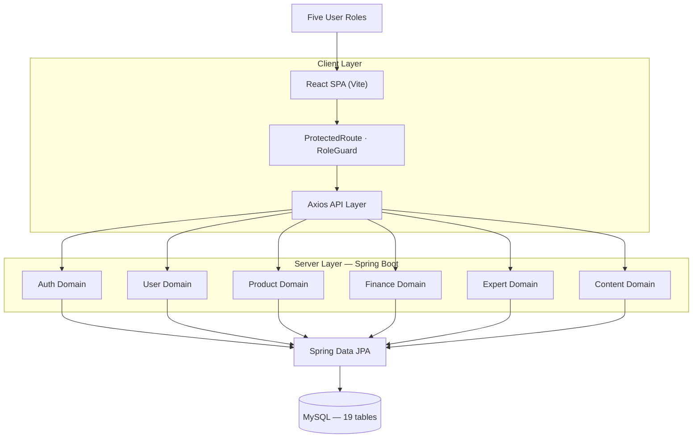
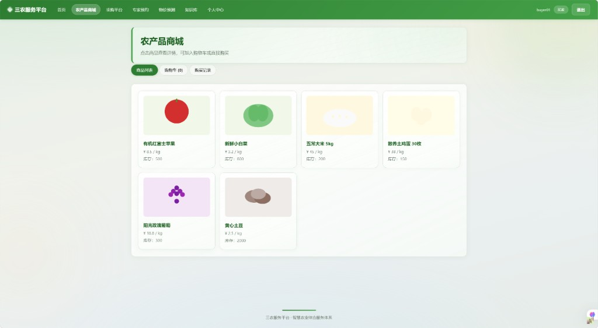
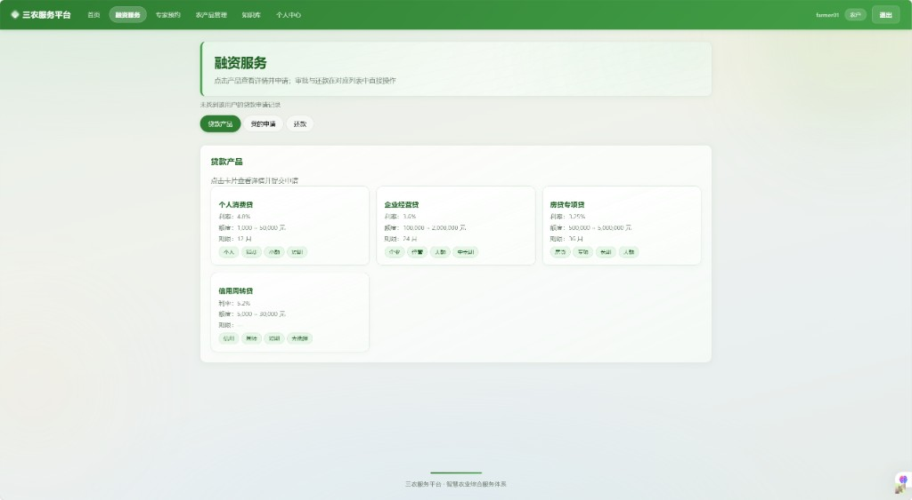
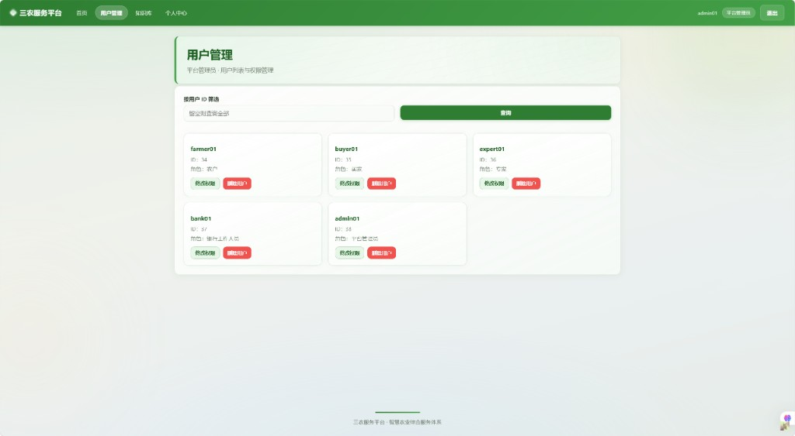

# Agricultural Service Platform

> A **multi-role agricultural service platform** with separate business workflows for trading, financing, expert consultation, and knowledge management.  
> Built as a **5-member team project** at Beijing Jiaotong University (Program Design Practicum).



<p align="center">
  
  
  
  
  
  
</p>

---

## Project Overview

Five user roles — farmers, buyers, experts, bank staff, and administrators — operate on a single platform with **different navigation, permissions, and business workflows**.

The system uses a **multi-role architecture (RBAC)** where each role has distinct feature access, UI entry points, and backend authorization boundaries (e.g. farmers publish products, buyers purchase, banks approve loans).

| Role | Key capabilities |
|------|------------------|
| Farmer | Product management, loan applications, expert booking |
| Buyer | Marketplace, purchase requests, price prediction |
| Expert | Appointment management, knowledge sharing |
| Bank | Loan review and approval |
| Admin | User and platform management |

---

## Architecture



**Business domains:** authentication & user profiles · product listing & checkout · loan application & approval · expert booking · agricultural knowledge & news · admin management.

---

## Project Statistics

| Metric | Count |
|--------|------:|
| Team size | 5 |
| Development period | 2025 |
| Frontend pages | 11 |
| REST API endpoints | 87 |
| Database tables | 19 |
| User roles (RBAC) | 5 |
| Backend integration tests | 15+ |
| Frontend unit tests | 50+ |

---

## Engineering Highlights

- Migrated the legacy vanilla JS frontend to **React + Vite + TypeScript**
- Designed a component-based SPA with reusable layout, modal, and route guard components
- Implemented **RBAC** with `ProtectedRoute` and `RoleGuard` across 11 pages
- Built a typed **Axios API layer** integrated with Spring Boot REST APIs (87 endpoints)
- Organized the codebase as a **monorepo** (frontend, backend, docs) with setup guide and seed data
- Configured **Vitest** and **JUnit** tests with a **GitHub Actions** CI pipeline
- Delivered end-to-end flows: marketplace checkout, loan application, expert booking, admin panel

---

## Screenshots

| Homepage | Marketplace |
|:--------:|:-----------:|
|  |  |
| Role-based dashboard | Product browsing and checkout |

| Financing | Admin Panel |
|:---------:|:-----------:|
|  |  |
| Loan product catalog | User management and permissions |

Additional screenshots (buyer dashboard, product management, expert booking) are in [`docs/images/`](docs/images/).

---

## Tech Stack

| Layer | Technologies |
|-------|-------------|
| **Frontend** | React · Vite · React Router · Axios · Chart.js · TypeScript |
| **Backend** | Spring Boot · Spring Security · Spring Data JPA · MySQL |
| **Authentication** | Spring Security · BCrypt · RBAC (5 roles) |
| **Testing** | Vitest · JUnit · Jacoco |
| **DevOps** | Git · GitHub Actions · Maven · npm |

---

## Quick Start

**Requirements:** JDK 17 · MySQL 8 · Node.js 18+

```powershell
# 1. Database & seed data — see docs/setup.md
# 2. Backend
cd backend
copy src\main\resources\application-local.yml.example src\main\resources\application-local.yml
.\mvnw.cmd spring-boot:run

# 3. Frontend
cd frontend
copy .env.example .env
npm install
npm run dev
```

- Frontend: `http://localhost:5173`
- Backend API: `http://localhost:8080`

**Test accounts** (password `123456`): `farmer01` · `buyer01` · `expert01` · `bank01` · `admin01`

See **[docs/setup.md](docs/setup.md)** for database setup and troubleshooting.

---

## Project Structure

```
.
├── frontend/     # React SPA (pages, components, API layer, auth context)
├── backend/      # Spring Boot API (domain-driven packages)
├── docs/         # Setup guide, seed data, screenshots
└── .github/      # CI workflows
```

---

## Testing

```powershell
# Backend
cd backend && .\mvnw.cmd test -Pcoverage

# Frontend
cd frontend && npm run typecheck && npm run test:coverage && npm run build
```

---

## License

[MIT](LICENSE)
